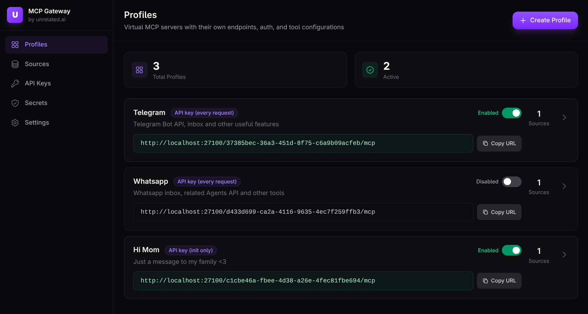
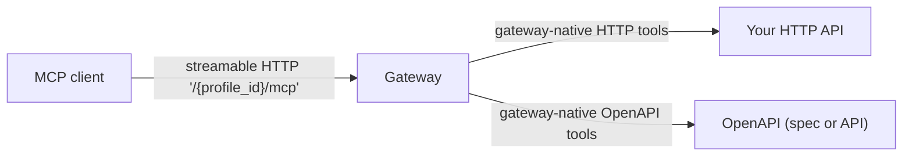
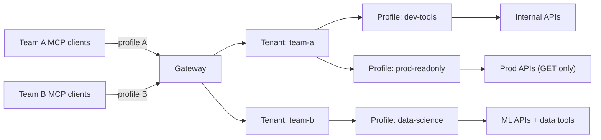
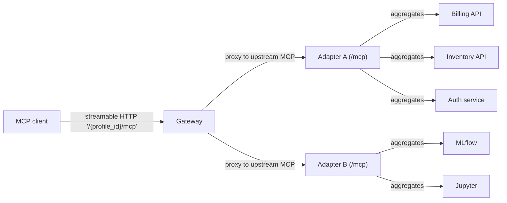

<div align="center">

# MCP Gateway by unrelated.ai

MCP infrastructure for turning existing systems into MCP servers and serving them safely at scale.

[](https://github.com/unrelated-ai/mcp-gateway/actions/workflows/ci.yml)
[](https://github.com/unrelated-ai/mcp-gateway/actions/workflows/security-rustsec.yml)
[](https://github.com/unrelated-ai/mcp-gateway/actions/workflows/security-trivy-adapter.yml)
[](https://github.com/unrelated-ai/mcp-gateway/actions/workflows/security-trivy-gateway.yml)
[](https://github.com/unrelated-ai/mcp-gateway/actions/workflows/security-trivy-migrator.yml)
[](https://github.com/unrelated-ai/mcp-gateway/actions/workflows/security-trivy-ui.yml)
[](LICENSE)



</div>

## Quick Start (recommended): Docker (published images) + Web UI

If you just want to try the product experience, this is the fastest path (no repo clone needed).

This example pins component versions (adjust as desired):

- Gateway + migrator: `0.10.0`
- Web UI: `0.6.0`

1. Download a Compose file that uses published images:

```bash
curl -fsSL -o mcp-gateway-compose.yml \
  https://raw.githubusercontent.com/unrelated-ai/mcp-gateway/main/docker-compose.quickstart.yml
```

2. Start the stack:

```bash
GATEWAY_VERSION=0.10.0 UI_VERSION=0.6.0 \
  docker compose -f mcp-gateway-compose.yml up -d
```

3. Open the Web UI:

- `http://127.0.0.1:27102`

On a fresh install (bootstrap enabled + empty DB), onboarding will guide you through creating the first tenant and profile.

4. Connect your MCP client to the profile endpoint you created in the UI:

- `http://127.0.0.1:27100/<PROFILE_ID>/mcp`

Useful commands:

- `docker compose -f mcp-gateway-compose.yml down` (stop the stack)
- `docker compose -f mcp-gateway-compose.yml down -v` (also wipe the DB volume)

## Quick Start (from source): Docker Compose + Web UI

If you're developing this repo locally, the Makefile-driven workflow is convenient:

```bash
make up
```

Useful commands:

- `make down` (stop the stack)
- `make up-reset` (wipe the demo DB; deletes all tenants/config; then run `make up` again to re-trigger onboarding)

Tip: this repo uses a Makefile heavily—run `make help` to see all targets.

## Why this exists

MCP clients need to call tools, but most real systems already exist as:

- HTTP APIs
- existing stdio MCP servers (node/python/etc)
- multiple internal services that need to be aggregated into one tool surface

This workspace makes those systems consumable via **streamable HTTP MCP** without rewriting them into a bespoke MCP server.

## What this ships

- **Adapter** (`unrelated-mcp-adapter`): expose HTTP/OpenAPI/stdio MCP as one MCP server at `/mcp`
- **Gateway** (`unrelated-mcp-gateway`): tenant/profile-based MCP proxy at `/{profile_id}/mcp` with auth and policy
- **Admin tooling**:
  - CLI (`unrelated-gateway-admin`)
  - Tenant-level Web UI (beta)

## Key concepts

| Concept | What it is | Why it’s useful |
|---|---|---|
| **Adapter** | One MCP server at `/mcp` that aggregates **stdio MCP**, **OpenAPI**, and **manual HTTP tools** | Turn “many backends” into one MCP endpoint (runs well inside a trusted network) |
| **Gateway** | Public-facing MCP endpoint `/{profile_id}/mcp` that proxies/aggregates upstream MCP sources and applies auth/policy | Run multi-tenant, policy-driven “virtual MCP servers” without exposing upstreams |
| **Tenant** | Isolation boundary in Mode 3 (Postgres) | Separate teams/projects/environments with isolated secrets and API keys |
| **Profile** | One “virtual MCP server” exposed as `/{profile_id}/mcp` | Create focused tool surfaces per use case (dev vs prod, read-only vs write, etc.) |

## What you can build with it

- **Expose a REST API as MCP tools**:
  - OpenAPI → tools, or
  - manual HTTP tools DSL → tools
- **Publish stdio MCP servers over HTTP** by spawning them as child processes and re-exposing the tool surface at `/mcp`.
- **Aggregate multiple tool sources** into one MCP endpoint (and keep names stable by collision prefixing when needed).
- **Operate a tenant-scoped gateway**:
  - API keys and optional OIDC/JWT for data-plane auth
  - per-profile tool allowlists, transforms (rename/defaults/parameter tuning), and tool-call limits (timeouts/retries/quotas)
  - HA-friendly session routing via Gateway session tokens (`Mcp-Session-Id`)

### Deployment configurations

#### 1. Solo developer

**Just the Gateway, no Adapters needed.**

Use the Gateway with gateway-native HTTP/OpenAPI sources and connect your MCP client to a single profile endpoint.



#### 2. Team with multiple projects

**Gateway with Tenants and Profiles.**

Each tenant owns multiple profiles, where each profile is a focused “virtual MCP server” with its own tool surface and data-plane auth/policy.



#### 3. Complex / company-wide

**Gateway + Adapters for aggregation and splitting.**

Use Adapters to bundle related systems into upstream MCP endpoints (typically inside a private network), then use Gateway profiles to expose focused tool surfaces to clients.



## Adapter: what it exposes

The Adapter exposes one MCP server over streamable HTTP:

- **MCP endpoint**: **`/mcp`**
- **Operational endpoints**: `/health`, `/health/any`, `/health/all`, `/ready`, `/status`, `/map`

## Documentation

- Start here (workspace docs index): [`docs/INDEX.md`](docs/INDEX.md)
- Component docs:
  - Adapter: [`docs/adapter/INDEX.md`](docs/adapter/INDEX.md)
  - Gateway: [`docs/gateway/INDEX.md`](docs/gateway/INDEX.md)
  - Gateway CLI: [`docs/gateway-cli/INDEX.md`](docs/gateway-cli/INDEX.md)
  - Web UI: [`docs/ui/INDEX.md`](docs/ui/INDEX.md)
- CI/CD + releases: [`docs/CICD.md`](docs/CICD.md)
- Workspace layout: [`docs/WORKSPACE.md`](docs/WORKSPACE.md)

## Other ways to run (local dev)

This section shows a few common ways to run pieces locally. Many commands have convenient Make targets (see `make help`).

### Local (cargo)

- Build + run the adapter with the example config (recommended):
  - `make adapter-run`
- Or build a static release binary:
  - `make build-release-adapter`

Equivalent raw `cargo` commands:

- `cargo build --release -p unrelated-mcp-adapter`
- `cargo run -p unrelated-mcp-adapter --bin unrelated-mcp-adapter -- --config ./tests/fixtures/test-config.yaml --bind 127.0.0.1:8080`

- More example configs (and a handy playground) live under [`tests/fixtures/`](./tests/fixtures/) — these are used by the demo stack and integration tests, and some are intentionally invalid to demonstrate validation errors.

### Docker

- Build the adapter image:
  - `make docker-build-adapter`
- Run the adapter container (standalone, without compose):
  - `make docker-run-adapter`

### Docker Compose (Gateway + multiple Adapters)

The default `docker-compose.yml` now spins up:

- Postgres for Mode 3 (`gateway_db`) + a migrator job (`gateway_db_migrate`)
- a Mode 3 Gateway (`gateway`) exposing:
  - data plane: `http://127.0.0.1:27100`
  - admin/control plane: `http://127.0.0.1:27101` (token: `dev-admin-token` in compose)
- a Web UI (`gateway_ui`) on `http://127.0.0.1:27102`
- 3 adapters (`adapter_http_tools`, `adapter_openapi`, `adapter_stdio_aggregation`) plus example backends (`httpbin`, `petstore`)

Run:

- `make up`

Then create a tenant + profile (preferably via the Web UI) and connect your MCP client to:

- **Gateway data plane**: `http://127.0.0.1:27100/<PROFILE_ID>/mcp`

Notes:

- The compose stack sets a **dev-only** default `UNRELATED_GATEWAY_SECRET_KEYS` so Mode 3 tenant secrets can be encrypted at rest (override this in real deployments).
- Adapters are still exposed individually on their mapped ports for debugging.

Gateway admin CLI:

- Run: `make cli-dev CLI_ARGS="--help"` (docs: [`docs/gateway-cli/INDEX.md`](docs/gateway-cli/INDEX.md))

Web UI:

- Open `http://127.0.0.1:27102`
- On a fresh install (bootstrap enabled + empty DB), onboarding will guide creating the first tenant.

### Install options

- Docker image: `ghcr.io/unrelated-ai/mcp-adapter`
  - Stable tags publish `:latest` + `:X.Y.Z`
  - Pre-release tags publish `:X.Y.Z-rc.N`
- GitHub Release binaries: static Linux build (`x86_64-unknown-linux-musl`)

If your **stdio MCP servers** require extra runtimes (node/python/etc), build your own image and copy the adapter binary from the published image:

```dockerfile
FROM alpine:3.20
RUN apk add --no-cache ca-certificates nodejs npm
COPY --from=ghcr.io/unrelated-ai/mcp-adapter:latest /app/unrelated-mcp-adapter /app/unrelated-mcp-adapter
ENTRYPOINT ["/app/unrelated-mcp-adapter"]
```

The published adapter image is a minimal image containing a **static** adapter binary, so it can be copied into Alpine/Debian/etc (same CPU architecture).

### Examples

Each example below is a complete YAML config file (you can also use JSON). The key part is the `servers:` map.

Once running, the adapter serves the resulting MCP tools over **streamable HTTP** (`/mcp`). Tool names are usually the tool key (like `create_invoice`); if two servers define the same tool name, the adapter prefixes on collision (`serverName:toolName`).

#### HTTP tools (manual HTTP DSL)

```yaml
imports: []
servers:
  billing_api:
    type: http
    baseUrl: http://billing-api:8080
    tools:
      create_invoice:
        method: POST
        path: /v1/invoices/{customerId}
        description: Create an invoice for a customer and return the created invoice JSON.
        params:
          customerId:
            in: path
            required: true
            schema:
              type: string
          dryRun:
            in: query
            schema:
              type: boolean
          body:
            in: body
            required: true
            schema:
              type: object
              properties:
                amountCents:
                  type: integer
                currency:
                  type: string
              required:
                - amountCents
                - currency
```

Result: exposes an MCP tool named `create_invoice` (or `billing_api:create_invoice` on collision). It takes `customerId` (string, path), `dryRun` (boolean, query), and `body` (JSON object).

#### OpenAPI (auto-discover tools from a spec)

```yaml
imports: []
servers:
  orders_api:
    type: openapi
    spec: ./openapi/orders.yaml
    baseUrl: https://api.example.com
    autoDiscover:
      include:
        - "GET *"
      exclude:
        - "DELETE *"
```

Result: exposes one MCP tool per discovered OpenAPI operation (here: all `GET` operations except `DELETE`). Tool names come from `operationId` when present; tool parameters come from the OpenAPI schema (path/query/header/body).

#### MCP stdio (spawn a local MCP server process)

```yaml
imports: []
servers:
  local_mcp:
    type: stdio
    command: /usr/local/bin/my-mcp-server
    args:
      - "--mode"
      - "prod"
    env:
      API_TOKEN: "${API_TOKEN}"
```

Result: spawns the process and re-exposes whatever tools/prompts/resources that MCP server provides (through the adapter’s MCP endpoint, `/mcp`). `env` values support `${VAR}` expansion.

## Project meta

- Changelog: [`CHANGELOG.md`](CHANGELOG.md)
- Contributing: [`CONTRIBUTING.md`](CONTRIBUTING.md)
- Security policy: [`SECURITY.md`](SECURITY.md)
