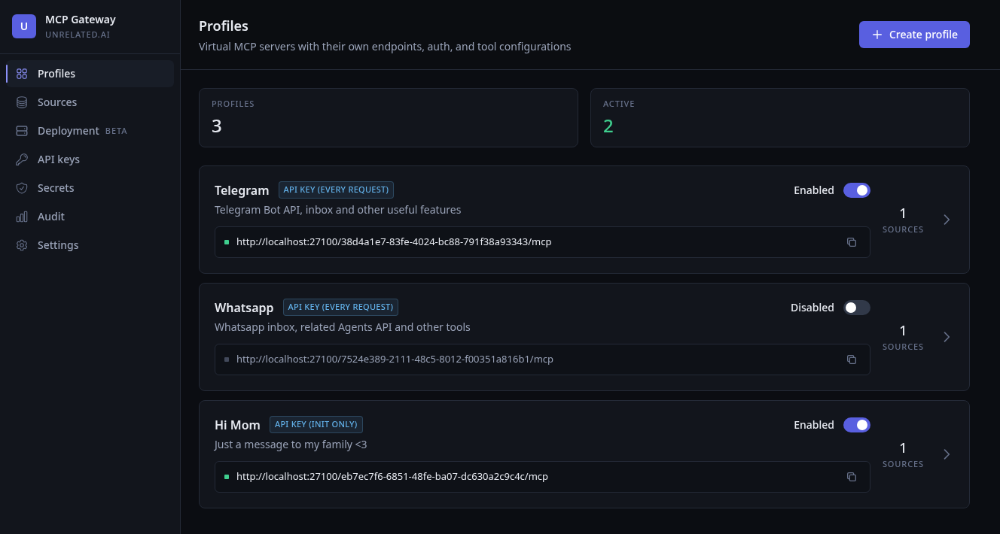
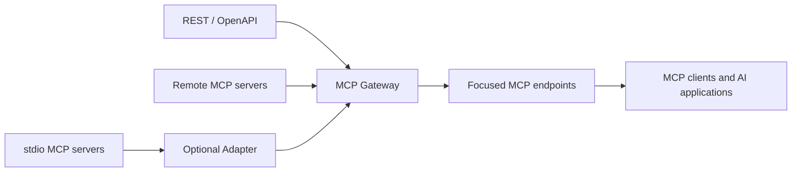

<div align="center">

# MCP Gateway

**Give AI applications safe access to the APIs and MCP servers you already run.**

Turn REST/OpenAPI services and existing MCP servers into focused, secured MCP
endpoints—without rebuilding every integration from scratch.

[](https://github.com/unrelated-ai/mcp-gateway/actions/workflows/ci.yml)
[](https://github.com/unrelated-ai/mcp-gateway/actions/workflows/security-rustsec.yml)
[](https://github.com/unrelated-ai/mcp-gateway/actions/workflows/security-cargo-deny.yml)
[](LICENSE)

</div>

MCP Gateway sits between your MCP clients and the systems they need to use:

- Connect existing **REST APIs**, **OpenAPI services**, and **MCP servers**.
- Combine tools from multiple systems behind one stable endpoint.
- Create focused tool surfaces for different teams, environments, or agents.
- Control access with API keys or OIDC, tool policies, limits, secrets, and audit logging.
- Run locally with Docker or deploy to Kubernetes.



<p align="center">
  <sub>Each profile exposes its own MCP endpoint, authentication mode, and set of tool sources.</sub>
</p>

## How it works


```mermaid
flowchart LR
  APIs["REST / OpenAPI"] --> Gateway["MCP Gateway"]
  Remote["Remote MCP servers"] --> Gateway
  Stdio["stdio MCP servers"] --> Adapter["Optional Adapter"]
  Adapter --> Gateway
  Gateway --> Profiles["Focused MCP endpoints"]
  Profiles --> Clients["MCP clients and AI applications"]
```

The Gateway can expose HTTP/OpenAPI tools directly and proxy remote MCP servers. The optional
Adapter publishes local stdio MCP servers over streamable HTTP and can aggregate related systems
before they reach the Gateway.

Each **profile** is a virtual MCP server with its own endpoint, tools, authentication, and policy.
One deployment can serve a single developer or isolate many teams and environments.

## When MCP Gateway is useful

Use it when you want to:

- Give an MCP client access to an existing API without writing a bespoke MCP server.
- Publish a local stdio MCP server over streamable HTTP.
- Combine tools from several services into one MCP endpoint.
- Expose different tools to development, production, or read-only clients.
- Put authentication, quotas, timeouts, retries, and audit logging in front of MCP tools.
- Isolate teams or projects without deploying a separate gateway for each one.

## Try it locally

The quickest path uses published Docker images and does not require cloning this repository.

**Prerequisite:** Docker with Docker Compose.

1. Download the quickstart Compose file:

```bash
curl -fsSL -o mcp-gateway-compose.yml \
  https://raw.githubusercontent.com/unrelated-ai/mcp-gateway/main/docker-compose.quickstart.yml
```

2. Start the Gateway and Web UI:

```bash
GATEWAY_VERSION=0.13.3 UI_VERSION=0.9.2 \
  docker compose -f mcp-gateway-compose.yml up -d
```

3. Open [http://127.0.0.1:27102](http://127.0.0.1:27102).

The onboarding flow creates your first tenant and starter profile. From there:

1. Add an HTTP/OpenAPI or MCP source.
2. Attach it to a profile.
3. Create an API key for the profile and save the secret shown once.
4. Copy the profile endpoint into your MCP client and send the key as
   `Authorization: Bearer <API_KEY_SECRET>` on every request.

Each profile is available at:

```text
http://127.0.0.1:27100/<PROFILE_ID>/mcp
```

On first use, the quickstart starts with an empty database so you can connect the systems you
actually want to expose. The named volume preserves that data across restarts until you remove it.

To stop or reset it:

```bash
docker compose -f mcp-gateway-compose.yml down
docker compose -f mcp-gateway-compose.yml down -v # also delete local data
```

## What you get

| Area               | Capabilities                                                                        |
| ------------------ | ----------------------------------------------------------------------------------- |
| **Sources**        | Manual HTTP tools, OpenAPI discovery, remote MCP, and stdio MCP through the Adapter |
| **Endpoints**      | Streamable HTTP MCP endpoints with stable profile URLs                              |
| **Tool control**   | Allowlists, renaming, defaults, parameter tuning, timeouts, retries, and quotas     |
| **Access control** | API keys, optional OIDC/JWT, tenant isolation, and encrypted tenant secrets         |
| **Operations**     | Audit events, transport limits, health endpoints, CLI administration, and Web UI    |
| **Deployment**     | Docker Compose for local use and Helm charts for Kubernetes                         |

## Core concepts

| Concept     | Meaning                                                                                         |
| ----------- | ----------------------------------------------------------------------------------------------- |
| **Gateway** | The public-facing service that exposes secured profile endpoints and routes tool calls          |
| **Profile** | A focused virtual MCP server with its own endpoint, sources, authentication, and policy         |
| **Tenant**  | An isolation boundary for profiles, secrets, and API keys                                       |
| **Source**  | An HTTP/OpenAPI tool source or upstream MCP server attached to a profile                        |
| **Adapter** | An optional service that exposes HTTP, OpenAPI, or stdio MCP sources as one remote MCP endpoint |

## Deployment options

| Setup                     | Best for                                                    | Shape                                            |
| ------------------------- | ----------------------------------------------------------- | ------------------------------------------------ |
| **Gateway only**          | A developer or small deployment exposing HTTP/OpenAPI tools | MCP clients → Gateway → APIs                     |
| **Gateway with tenants**  | Multiple teams, projects, or environments                   | MCP clients → tenant profiles → isolated sources |
| **Gateway with Adapters** | Larger installations and existing stdio MCP servers         | MCP clients → Gateway → private-network Adapters |

The Gateway supports HA-friendly session routing through Gateway session tokens
(`Mcp-Session-Id`). Adapters normally run close to the systems they expose, while the Gateway
provides the public endpoint and shared policy layer.

## Components

- **Gateway** (`unrelated-mcp-gateway`): tenant/profile-based MCP routing, authentication, policy,
  limits, and audit logging.
- **Adapter** (`unrelated-mcp-adapter`): expose HTTP, OpenAPI, or stdio MCP sources through one
  streamable HTTP MCP endpoint.
- **Web UI**: tenant onboarding and management for sources, profiles, keys, secrets, audit, and
  settings.
- **Admin CLI** (`unrelated-gateway-admin`): operator and automation workflows.
- **Gateway Operator**: managed MCP deployment support for Kubernetes.

## Documentation

- [Documentation index](docs/INDEX.md)
- [Gateway](docs/gateway/INDEX.md)
  - [MCP proxying and aggregation](docs/gateway/MCP_PROXYING.md)
  - [Data-plane authentication](docs/gateway/DATA_PLANE_AUTH.md)
  - [MCP settings and trust controls](docs/gateway/MCP_SETTINGS.md)
  - [Audit logging](docs/gateway/AUDIT.md)
- [Adapter](docs/adapter/INDEX.md)
  - [Manual HTTP tools](docs/adapter/config/SERVERS_HTTP.md)
  - [OpenAPI tools](docs/adapter/config/SERVERS_OPENAPI.md)
  - [stdio MCP servers](docs/adapter/config/SERVERS_STDIO.md)
- [Web UI](docs/ui/INDEX.md)
- [Gateway CLI](docs/gateway-cli/INDEX.md)
- [Helm deployment](docs/deploy/HELM.md)
- [CI/CD and releases](docs/CICD.md)
- [Workspace layout](docs/WORKSPACE.md)

## Develop from source

Start the complete development stack:

```bash
make up
```

This starts Postgres, the migrator, Gateway, Web UI, example adapters, HTTPBin, and Petstore.
Open the UI at [http://127.0.0.1:27102](http://127.0.0.1:27102).

Useful commands:

```bash
make help      # list available targets
make down      # stop the stack
make up-reset  # delete demo data; run make up afterward
```

For component-level development:

- Run the Adapter with an example config: `make adapter-run`
- Build the static Adapter binary: `make build-release-adapter`
- Run the admin CLI: `make cli-dev CLI_ARGS="--help"`
- Browse the commented example configurations in [`tests/fixtures/`](tests/fixtures/)
- See the [Adapter testing guide](docs/adapter/TESTING.md)

## Images and release artifacts

Published container images:

- `ghcr.io/unrelated-ai/mcp-gateway`
- `ghcr.io/unrelated-ai/mcp-gateway-migrator`
- `ghcr.io/unrelated-ai/mcp-gateway-operator`
- `ghcr.io/unrelated-ai/mcp-gateway-ui`
- `ghcr.io/unrelated-ai/mcp-adapter`

Stable releases use `:latest` and `:X.Y.Z` tags. Pre-releases use `:X.Y.Z-rc.N`.
GitHub Releases also include static Linux Adapter and Gateway admin CLI binaries for
`x86_64-unknown-linux-musl` under their respective release tags.

The published Adapter image contains a minimal static binary. If your stdio MCP servers require
Node, Python, or other runtimes, copy that binary into your own runtime image. See the
[stdio server documentation](docs/adapter/config/SERVERS_STDIO.md).

## Project health

[](https://github.com/unrelated-ai/mcp-gateway/actions/workflows/security-trivy-adapter.yml)
[](https://github.com/unrelated-ai/mcp-gateway/actions/workflows/security-trivy-gateway.yml)
[](https://github.com/unrelated-ai/mcp-gateway/actions/workflows/security-trivy-operator.yml)
[](https://github.com/unrelated-ai/mcp-gateway/actions/workflows/security-trivy-migrator.yml)
[](https://github.com/unrelated-ai/mcp-gateway/actions/workflows/security-trivy-ui.yml)

## Project meta

- [Changelog](CHANGELOG.md)
- [Contributing](CONTRIBUTING.md)
- [Security policy](SECURITY.md)
- Licensed under the [MIT License](LICENSE)
