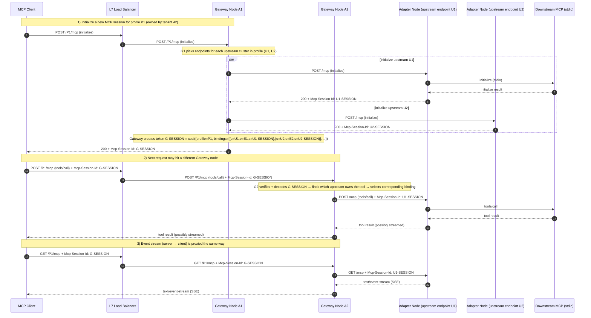

# Gateway architecture

## Purpose

The Gateway is the **public-facing** MCP endpoint for clients.

Today it provides **profile-based MCP proxying + upstream aggregation** and **HA-ready session routing** (stateless session tokens), plus a bearer-token-protected **admin/control plane** (Mode 3 / Postgres).

Tenant-facing **data-plane authn/z** is implemented (API keys + OIDC/JWT, configured per profile). Broader policy (audit detail levels, resources/prompts allow/deny) is still evolving.

## Key concepts

- **Tenant**: an isolated configuration scope, addressed by **id only**.
- **Profile**: a tenant-owned endpoint (path) that defines routing to upstream adapter(s). Different profiles can route differently.

## High-level data flow

```text
MCP Client
  |
  |  (streamable HTTP /{profile_id}/mcp)
  v
Gateway
  |
  |  (streamable HTTP /mcp) + (optional /map discovery)
  v
Adapter(s)
  |
  |  stdio MCP child processes / HTTP APIs / OpenAPI backends
  v
Systems
```

## Responsibilities split

- **Adapter**
  - Expose tools/resources/prompts over `/mcp`
  - Aggregate multiple backends
  - Provide operational metadata via `/map` for routing/UI
  - No inbound authn/z, tenancy, or policy

- **Gateway**
  - Authenticate/authorize incoming clients
  - Select tenant and apply tenant policy
  - Route/proxy MCP requests to upstream Adapter(s)
  - Provide cross-profile/session routing and aggregation behaviors

## Authorization forwarding stance (important)

We follow MCP security guidance to avoid “confused deputy” risks:

- **Data plane**: the caller’s `Authorization` header (used to authenticate the caller to the Gateway) is **never forwarded** to:
  - upstream MCP servers (Adapters or other MCP servers), or
  - gateway-native HTTP/OpenAPI tool execution.
- **Upstream credentials are explicit**:
  - For gateway-native HTTP/OpenAPI sources, auth is configured per-source (and can reference tenant secrets via `${secret:<name>}` in Mode 3).
  - For upstream MCP servers that require auth, credentials are provided via Gateway configuration (not by reusing the caller’s auth). In Mode 3, upstream endpoints support outbound auth config including:
    - `bearer` (Authorization header)
    - `basic` (Authorization header)
    - `header` (custom header, e.g. `x-api-key`)
    - `query` (query parameter)

Related docs:

- Mode 3 secrets and `${secret:...}` placeholders: `docs/gateway/MODE3_TENANT_OVERLAY.md`
  - In Mode 3, tenant secrets are encrypted at rest by the Gateway (configure `UNRELATED_GATEWAY_SECRET_KEYS`).
- Adapter outbound auth config: `docs/adapter/config/AUTH.md`

## Configuration and control plane (current)

The Gateway supports two storage/config modes:

- **Mode 1**: config-file driven (read-only; data plane only)
- **Mode 3**: Postgres-backed (admin API enabled; HA-ready)

Notes:

- Admin UI (operator-scoped) is not implemented (CLI is the primary admin interface).
- Tenant-scoped Web UI exists (beta): [`docs/ui/INDEX.md`](../ui/INDEX.md).
- Claim-based RBAC is not implemented (current model is API key + OIDC principal bindings).
- Audit logging (Mode 3 / Postgres): [`docs/gateway/AUDIT.md`](AUDIT.md).

### Ports (from the start)

Run the Gateway with two listeners:

- **Data plane bind**: profile MCP endpoints (`/{profile_id}/mcp`)
- **Admin bind**: admin API + operational endpoints (health/status/ready), protected by admin auth

This makes it easy to expose the data plane publicly while keeping admin/ops private.

### Control plane auth (current)

- Admin API auth (current): `Authorization: Bearer <token>` where the token comes from env/config (e.g. `UNRELATED_GATEWAY_ADMIN_TOKEN`).
- Tenant API auth (Mode 3): `Authorization: Bearer <tenant_token>` where the tenant token is issued by the admin API (`POST /admin/v1/tenant-tokens`).
- Data plane auth (implemented):
  - Per-profile `dataPlaneAuth` policy (Mode 3): `disabled` | `apiKeyInitializeOnly` | `apiKeyEveryRequest` | `jwtEveryRequest`
  - API key secret header formats:
    - `Authorization: Bearer <api_key_secret>` (primary)
    - `x-api-key: <api_key_secret>` (optional alias when `acceptXApiKey=true`)
  - OIDC/JWT header format:
    - `Authorization: Bearer <jwt>` (required on every request when `mode=jwtEveryRequest`)
    - OIDC is enabled/configured via env (`UNRELATED_GATEWAY_OIDC_ISSUER`, etc.)
  - Mode 1 can optionally enable static API keys via `dataPlaneAuth` in the config file.
  - Per-profile `dataPlaneLimits` policy (Mode 3, optional; disabled by default):
    - fixed-window per-minute `tools/call` rate limit (per API key)
    - `tools/call` quota (per API key; decremented on attempt)

## HA and session routing (Model B)

### Why this exists at all

With MCP-over-streamable-HTTP, the client and server communicate using a **session id** (`Mcp-Session-Id`). This session id is not just a “nice to have”:

- It’s how the **streamable HTTP transport** correlates requests with the right server-side session (similar to how a WebSocket connection implicitly carries “session affinity”).
- Many MCP servers are **stateful per session** (examples: headless browser control, in-memory caches, conversational context, resource subscriptions, long-running operations).

So, in any Gateway that can run multiple nodes, we must ensure:

- **All requests for a given MCP session** are routed to the same upstream MCP session (and usually the same upstream *node* that owns that session).
- This must still work even if the load balancer sends requests to different Gateway nodes.

### Model B: stateless “Gateway session token”

Model B makes the **Gateway session id** a self-contained, cryptographically protected token that encodes where the upstream session(s) live.

At a minimum, the token needs:

- a token version
- profile id
- a list of upstream session bindings:
  - upstream id (logical cluster / adapter group)
  - endpoint id (the concrete adapter node chosen for this session)
  - upstream `Mcp-Session-Id`
- issue time and/or expiry
- signature (and optionally encryption)

This is similar in spirit to a JWT, but it is **not** an auth token: it is a **routing token** owned by the Gateway.

Current implementation notes (Gateway session token):

- **Token format**: **PASETO `v4.local`** (encrypted + authenticated).
  - Footer carries a short `kid` for key rotation (footer is authenticated but not encrypted).
- **Payload fields**: `profile_id`, `bindings[{ upstream, endpoint, session }]`, plus `iat`/`exp` (unix seconds).
- **Expiry**: enforced on every request; default TTL is 1 hour.
  - Configure TTL via `UNRELATED_GATEWAY_SESSION_TTL_SECS`.
- **Rotation**: configure one or more secrets via `UNRELATED_GATEWAY_SESSION_SECRETS` (comma-separated).
  - The first secret mints new tokens; all are accepted for verification.
  - For single-secret setups, `UNRELATED_GATEWAY_SESSION_SECRET` is also accepted as a fallback.
  - If neither env var is set, the Gateway generates an ephemeral secret at startup (not HA-safe).
- **Legacy compatibility**: the Gateway still accepts the old `v1.<b64(payload)>.<b64(hmac)>` format for migration.

### Flow (example)



### Key properties

- **No sticky sessions needed** between client ↔ LB ↔ Gateway, because any node can route by decoding the token.
- **New sessions can still be load-balanced**: the Gateway can choose an upstream endpoint when handling `initialize`.
- **Upstream sessions remain private**: the client only ever sees `G-SESSION`.

### Partial upstream availability (default behavior)

Profiles can aggregate multiple upstream adapters. In the real world, some upstreams can be temporarily down.

Default behavior:

- If some upstreams fail to initialize, the Gateway still returns a session with the healthy upstreams.
- It emits warnings (logs, and optionally surfaced to the client via `InitializeResult.instructions`).

### Do we need “stateful vs stateless upstream” config?

For streamable HTTP, we should assume **session-affinity is always required**, because the protocol uses `Mcp-Session-Id` and upstream servers commonly keep per-session state.

What we *can* configure is:

- how we **choose an upstream endpoint** for a *new* session (round-robin, least-connections, etc.)
- session idle timeouts / max lifetime
- whether the Gateway **signs only** (opaque but readable) or **encrypts** (opaque + confidential) its session tokens

Current behavior: for each upstream, the gateway **selects an endpoint during `initialize`** and pins the chosen `endpoint_id` in the signed session token:

- It starts at a pseudo-random index (per `initialize`) and tries endpoints in that order.
- If an endpoint is down, `initialize` **fails over** to the next endpoint (best-effort).

### Tool call timeouts + retries (Gateway ↔ Adapter coordination)

For `tools/call` only, the Gateway enforces a **timeout budget** (and optional retries):

- **Global default**: `UNRELATED_TOOL_CALL_TIMEOUT_DEFAULT_SECS` (defaults to `60`).
- **Global cap (max)**: `UNRELATED_TOOL_CALL_TIMEOUT_MAX_SECS` (defaults to `60`).
- **Legacy fallback**: `UNRELATED_TOOL_CALL_TIMEOUT_SECS` (sets both default + max cap).
- **Per-profile override** (Mode 3): `profiles.tool_call_timeout_secs` (`toolCallTimeoutSecs` via APIs).
- **Per-tool overrides** (Mode 3): `profiles.tool_policies` (`toolPolicies[]` via APIs).
- **Propagation to upstreams**: the Gateway sends `params._meta.unrelated.timeoutMs` on upstream `tools/call` requests.
  - The Adapter reads this budget from `RequestContext.meta` and clamps it to its configured `callTimeout` (and the shared max cap).
- **Retries**: disabled by default; enable per-tool via `toolPolicies[].retry` (Temporal-style fields).
  - Retries are Gateway-side only and consume the same overall timeout budget.

## Storage modes (current)

- **Mode 1 (minimal)**: static config file only (no runtime writes).
- **Mode 3 (HA)**: Postgres.

## Observability

The Gateway emits structured logs and is intended to be deployed behind your normal observability stack.
